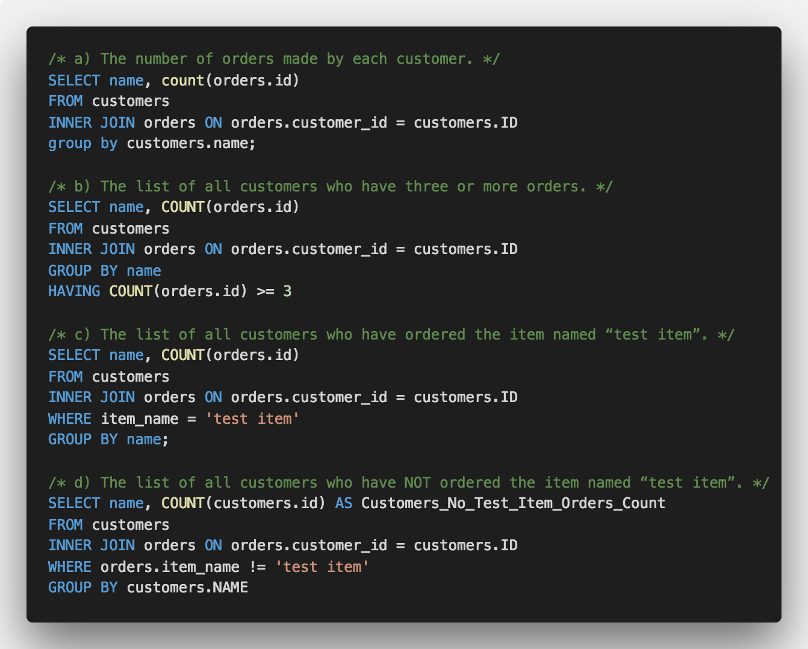

# 1. Write JavaScript Function

The function takes an integer as a parameter and returns the number of 1s in the binary representation of that number (without converting the number to a binary string).

As a bonus you can make it a recursive function.

# 2. You have a SQL database with the following two tables:

## Customers

id
name

## Orders

id
customer_id
item_name

## Write SQL queries to return the following information:

* The number of orders made by each customer.
* The list of all customers who have three or more orders.
* The list of all customers who have ordered the item named “test item”.
* The list of all customers who have NOT ordered the item named “test item”.

# 3. Create a web interface with modern javascript framework or libaray( REACT NATIVE ) that should do the following:

* Make a request to: https://jsonplaceholder.typicode.com/photos
* Display thumbnail versions of the images in the returned JSON. Images should be loaded only if user scrolled to display the image.
* If a thumbnail is tapped it should switch to another view to show the full size image.
* Cache all of the images locally based on their ID.

# 4. Create a program in the back-end language of your choice that loads that JSON file from disk, extract the months of all the birthdays, and count how many people have a birthday in each month. Your program should output something like:

You have a file on disk called birthdays.json which contains the following data:

{
“Albert Einstein”: “03/14/1879”,
“Benjamin Franklin”: “01/17/1706”,
“Ada Lovelace”: “12/10/1815”,
“Donald Trump”: “06/14/1946”,
“Rowan Atkinson”: “01/6/1955”
}

Expected Output:

{
"May": 3,
"November": 2,
"December": 1
}

RUBY

# 5. Create a web interface with modern javascript framework or libaray( REACTJS ) that does the following:
* Make a request to: https://jsonplaceholder.typicode.com/photos
* Display thumbnail versions of the images in the returned JSON. Images should be loaded only if user scrolled to display the image.
* If a thumbnail is tapped it should switch to another view to show the full size image.
* Cache all of the images locally based on their ID.

